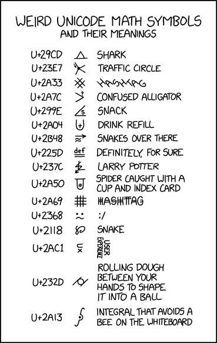

# Kata Alien

> **À propos**
>
> ⓘ Ceci est la donnée d'un [kata], un _exercice de programmation_ qui se
> déroule généralement dans le cadre d'un [coding dojo]. Il est proposé aux
> membres du dojo de l'[EPFL] et fait partie d'une collection de différents
> katas identifiés par le tag **[epfl-dojo-kata]** sur GitHub.  
> Vous êtes plus que bienvenu d'essayer de le réaliser dans le langage de
> programmation de votre choix. Lorsque c'est terminé, ajoutez-vous à la liste
> de ceux qui l'ont fait dans ce document en proposant une [Pull Request]. Vous
> pouvez également **[epfl-dojo-kata]** partager votre intérêt pour ce dépôt en
> le «[stargazant]».  
> Bonne lecture et bon code !

[kata]: https://fr.wikipedia.org/wiki/Coding_dojo#Kata
[coding dojo]: https://fr.wikipedia.org/wiki/Coding_dojo
[EPFL]: https://www.epfl.ch
[epfl-dojo-kata]: https://github.com/topics/epfl-dojo-kata
[Pull Request]: https://docs.github.com/en/pull-requests/collaborating-with-pull-requests/proposing-changes-to-your-work-with-pull-requests/about-pull-requests
[stargazant]: https://docs.github.com/en/get-started/exploring-projects-on-github/saving-repositories-with-stars

## Introduction

  
Source: https://xkcd.com/2606/

## But

Le but de ce kata est d'inventer un alphabète extra-terrestre en se basant sur
des caractères unicodes « farfelus ». Le résultat doit être un convertisseur de
texte vers code alien et inversément (de code alien vers texte).

## Pour aller plus loin

Voici quelques idées pour faire évoluer le projet :
* Proposer un site web pour faire les convertions ;
* Proposer différentes variantes ;
* etc...

Le **[kata-braille](https://github.com/ponsfrilus/kata-braille)** et le 
le **[kata-morse](https://github.com/ponsfrilus/kata-morse)** sont dans le
même genre, n'hésitez pas à les faire aussi !

## Je l'ai fait 💪

* La version de [@octocat](https://github.com/octocat) a été faite en `langage`
  et est disponible [ici](https://#).
